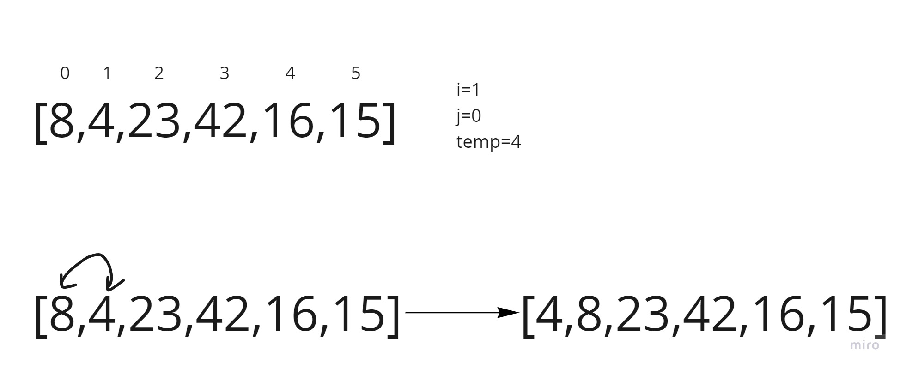
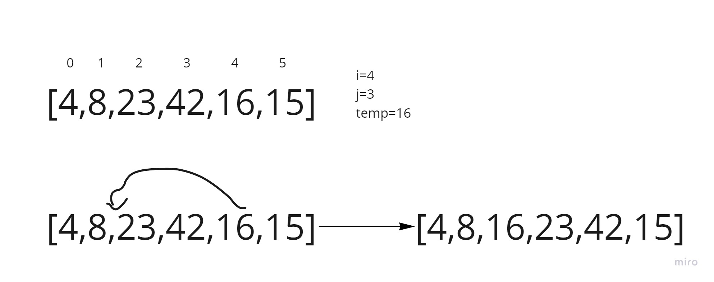

# Insertion Sort

Insertion sort is a simple sorting algorithm that builds the final sorted array (or list) one item at a time.

## Pseudocode

```pseudo
  InsertionSort(int[] arr)

    FOR i = 1 to arr.length

      int j <-- i - 1
      int temp <-- arr[i]

      WHILE j >= 0 AND temp < arr[j]
        arr[j + 1] <-- arr[j]
        j <-- j - 1

      arr[j + 1] <-- temp
```

## Trace

Sample Array: [8,4,23,42,16,15]

Pass 1:


Pass 2:


Pass 3:


## Efficency

Time: O(n^2)
The basic operation of this algorithm is comparison. This will happen n * (n-1) number of times…concluding the algorithm to be n squared.
Space: O(1)
No additional space is being created. This array is being sorted in place…keeping the space at constant O(1).
